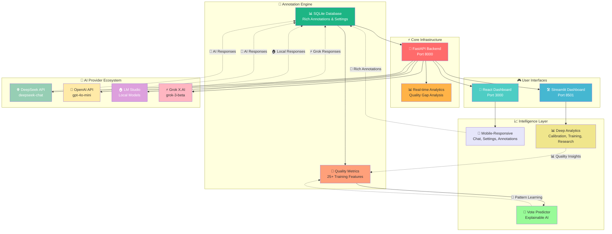

# 🚀 RLHF Loop System - **Dual Interface Platform**
### *Modern React + Classic Streamlit • Complete RLHF Pipeline*

[](https://python.org)
[](https://reactjs.org)
[](https://typescriptlang.org)
[](https://nextjs.org)
[](https://streamlit.io)
[](https://fastapi.tiangolo.com)
[](LICENSE)

---

## 🎯 **Two Powerful Interfaces, One Amazing Platform**

**Choose your experience:** Lightning-fast React dashboard for modern workflows, or feature-rich Streamlit for comprehensive analysis. Both share the same powerful RLHF backend with enhanced annotation system!

### 🔥 **Modern React Dashboard** - *Primary Interface*
**⚡ Fast startup • 📱 Mobile-responsive • 🎨 Clean design**

- **🚀 Fast Loading** - Quick startup and navigation
- **📱 Mobile-Friendly** - Responsive design that works on phones
- **⚡ Real-time Updates** - Live data without page refreshes
- **🎨 Modern UI/UX** - Clean, professional interface
- **🔄 AI Integration** - Built-in chat with 4 AI providers

### 🛠️ **Streamlit Dashboard** - *Feature-Rich Interface*
**📊 Comprehensive • 🔧 Analytics-focused • 🎮 Research-ready**

- **📊 Rich Analytics** - Advanced calibration & drift analysis
- **🔧 Admin Tools** - Batch processing & model training
- **📈 Deep Insights** - Multi-domain performance analysis
- **🎯 Research Ready** - Detailed visualizations and metrics

---

## 🚀 **⚡ SUPER QUICK START ⚡**
### *Get both interfaces running in under 60 seconds!*

```bash
# 1. Clone and setup
git clone https://github.com/Yousifus/rlhf_loop_humain.git
cd rlhf_loop_humain
pip install -r requirements.txt

# 2. 🚀 Start the backend API
cd api_backend && python main.py
```

**Now choose your interface:**

### 🚀 **Option A: Modern React Dashboard** *(Recommended)*
```bash
# In a new terminal:
cd web_modern
npm install && npm run dev

# 🎉 Open: http://localhost:3000
```

### 🛠️ **Option B: Streamlit Dashboard** *(Feature-rich)*
```bash
# In a new terminal:
streamlit run scripts/run_dashboard.py

# 🎉 Open: http://localhost:8501
```

### 🎯 **Option C: Both at the same time!** *(Ultimate setup)*
Run both commands above in separate terminals - use React for daily work, Streamlit for deep analysis!

---

## 📝 **Enhanced Annotation System**
*Rich feedback collection for better RLHF training*

### **🎯 Rich Feedback Collection:**
- **🎚️ Quality Sliders**: Rate accuracy, clarity, completeness, helpfulness, creativity (0-10 scale)
- **✅ Choice Reasons**: Better explanation, more accurate, clearer structure, better examples, etc.
- **❌ Rejection Reasons**: Factual errors, confusing explanation, poor organization, inappropriate tone, etc.
- **🎯 Confidence Rating**: How certain you are about your choice (0-100%)
- **💾 SQLite Storage**: All annotation data saved with rich quality metrics

### **🧠 Vote Predictor Training Enhancement:**
- **📈 Enhanced Features**: 25+ features vs basic 3-4 features
- **📊 Quality Gap Analysis**: Chosen vs rejected response scoring differences
- **🔍 Reason Pattern Learning**: Learns from your feedback patterns
- **⚖️ Confidence Weighting**: Higher confidence annotations weighted more in training
- **🤖 Explainable Predictions**: "I predict A because clarity gap +2.1, accuracy +1.8"

---

## 🤖 **AI Provider Integration**
*4 AI providers supported for model response generation*

### **🔗 Currently Integrated:**
- **🌐 DeepSeek** - `deepseek-chat` model (cost-effective)
- **🤖 OpenAI** - `gpt-4o-mini` and other GPT models  
- **🏠 LM Studio** - Local models (privacy-focused, auto-detects available models)
- **⚡ Grok (X.AI)** - `grok-3-beta` model (newest addition)

### **⚙️ Setup Options:**
- **React Interface**: Visual API key configuration in settings page
- **Streamlit**: Environment variable setup (`DEEPSEEK_API_KEY`, `OPENAI_API_KEY`, `XAI_API_KEY`)
- **LM Studio**: Auto-detection when local server is running on port 1234

---

## 🏗️ **System Architecture**



---

## ⚡ **Interface Comparison**

| Feature | 🚀 React Dashboard | 🛠️ Streamlit Dashboard | 
|---------|-------------------|----------------------|
| **⚡ Load Time** | Fast startup | Slower initialization |
| **📱 Mobile** | Responsive design | Desktop-optimized |
| **🎨 UI/UX** | Modern interface | Rich analytics |
| **🔄 Updates** | Real-time | Manual refresh |
| **🎯 Best For** | Daily monitoring, API setup | Deep analysis, research |
| **⚙️ Setup** | npm install | pip install |
| **🔗 API Config** | Visual settings page | Environment variables |

---

## ✅ **Current Features**

### **🚀 React Dashboard:**
- ✅ Overview page with metrics from SQLite database
- ✅ Settings page with visual API key management and testing
- ✅ Enhanced annotation interface with rich feedback collection
- ✅ Chat interface for testing all 4 AI providers
- ✅ Real-time analytics and interactive charts
- ✅ Mobile-responsive design

### **🛠️ Streamlit Dashboard:**  
- ✅ Comprehensive analytics dashboard
- ✅ Calibration analysis with reliability diagrams
- ✅ Model evolution tracking over time
- ✅ Drift detection visualization
- ✅ Batch processing tools and admin features
- ✅ Multi-domain performance analysis

### **⚡ Backend (FastAPI):**
- ✅ FastAPI server with automatic documentation at `/docs`
- ✅ SQLite database for annotations and settings
- ✅ 4-provider AI integration with testing endpoints
- ✅ Rich annotation data storage with quality metrics
- ✅ Real-time provider availability detection

---

## 🛠️ **Technology Stack**

### 🚀 **Modern React Frontend**
- **⚡ Next.js 14** - App router and server components
- **🎨 Tailwind CSS** - Responsive design system
- **📊 Recharts** - Interactive charts and visualizations  
- **🔧 TypeScript** - Type-safe development
- **🔄 Real-time API** - Fast data fetching

### 🛠️ **Classic Streamlit Interface**  
- **🎨 Streamlit** - Rapid prototyping and rich analytics
- **📊 Plotly** - Advanced visualizations
- **🔧 Admin Tools** - Batch processing and model management

### ⚡ **Shared Backend Infrastructure**
- **🚀 FastAPI** - High-performance API with automatic docs
- **🗄️ SQLite** - Local database for annotations and settings
- **📊 Analytics** - Calibration, drift detection, performance tracking
- **🔗 Multi-Provider** - DeepSeek, OpenAI, LM Studio, Grok integration

---

## 🎯 **Perfect Use Cases**

### 🚀 **React Dashboard Scenarios**
```bash
# 💼 Quick daily monitoring
npm run dev  # Fast startup, mobile-friendly

# 💬 Interactive AI testing
# Built-in chat interface with your configured AI providers

# ⚙️ Easy API configuration
# Visual setup, test connections with one click

# 📝 Rich annotation collection
# Enhanced feedback with quality sliders and detailed reasons
```

### 🛠️ **Streamlit Dashboard Scenarios**  
```bash
# 📊 Deep performance analysis
streamlit run scripts/run_dashboard.py

# 🔧 Model training and batch processing
# Advanced admin tools and research capabilities

# 📈 Research and development
# Detailed calibration, drift analysis, comprehensive metrics
```

---

## 🚀 **Quick Commands Reference**

### 🔥 **One-Command Startup Options**

```bash
# 🌟 OPTION 1: React-first (Recommended for daily use)
cd api_backend && python main.py &
cd web_modern && npm install && npm run dev

# 📊 OPTION 2: Streamlit-first (Recommended for analysis)  
cd api_backend && python main.py &
streamlit run scripts/run_dashboard.py

# 🚀 OPTION 3: Full stack (Both interfaces)
# Terminal 1: cd api_backend && python main.py
# Terminal 2: cd web_modern && npm run dev  
# Terminal 3: streamlit run scripts/run_dashboard.py
```

### 🎯 **Access Points**
- **🚀 React Dashboard**: http://localhost:3000
- **🛠️ Streamlit Dashboard**: http://localhost:8501  
- **⚡ API Documentation**: http://localhost:8000/docs
- **📊 API Health Check**: http://localhost:8000/health

---

## 📚 **Documentation & Resources**

| Resource | Description | Best Interface |
|----------|-------------|----------------|
| [`QUICK_START.md`](QUICK_START.md) | **🚀 Quick setup guide** | Both |
| [`INTERFACES.md`](INTERFACES.md) | **🤔 Interface comparison** | Both |
| [`docs/MILESTONES.md`](docs/MILESTONES.md) | **🧭 Project evolution timeline** | Both |
| [`docs/architecture.md`](docs/architecture.md) | Technical architecture | Both |
| [`interface/dashboard_README.md`](interface/dashboard_README.md) | Streamlit features | Streamlit |
| [`docs/DEPLOYMENT.md`](docs/DEPLOYMENT.md) | Production deployment | Both |

---

## 🤝 **Contributing & Development**

### 🚀 **React Development**
```bash
# Setup
cd web_modern
npm install

# Development
npm run dev      # Hot reload development server
npm run build    # Production build
npm run type-check  # TypeScript validation
```

### 🛠️ **Streamlit Development**  
```bash
# Setup
pip install -r requirements.txt

# Development  
streamlit run scripts/run_dashboard.py
python -m pytest tests/ --cov=.
```

### ⚡ **Backend Development**
```bash
# FastAPI server
cd api_backend
python main.py

# API documentation: http://localhost:8000/docs
```

---

## 📄 **License**

This project is licensed under the MIT License - see the [LICENSE](LICENSE) file for details.

---

## 🏆 **Recognition & Acknowledgments**

Built with modern industry-standard tools:

- **⚡ Next.js & React** - Modern web development framework
- **🚀 FastAPI** - High-performance Python API framework  
- **🎨 Streamlit** - Rapid analytics prototyping platform
- **🤗 Hugging Face** - Transformers ecosystem and model architecture
- **🔥 PyTorch** - Deep learning platform
- **🤖 Claude (Anthropic)** - AI-assisted development and optimization

---

<div align="center">

### 🌟 **Dual Interface RLHF Platform** 🌟

*Choose Your Experience: ⚡ Fast React or 📊 Feature-Rich Streamlit*

**🎯 Enhanced annotation system with 4 AI provider support**

**🚀 React**: Modern • Mobile • Fast  
**🛠️ Streamlit**: Comprehensive • Analytical • Rich

[](https://github.com/Yousifus/rlhf_loop_humain/stargazers)
[](https://github.com/Yousifus/rlhf_loop_humain/network/members)

</div>

---

## 🌊 **Built Through Collaborative Intelligence**

*Reflective systems architect exploring RLHF as memory, cognition, and evolution.*

**🧠 Claude (Anthropic)** • Technical implementation and systematic architecture  
**🤖 Glyph (OpenAI)** • Philosophical insights and system conceptualization  
**🔍 Perplexity** • Research and knowledge synthesis  
**⚡ Yousef** • Visionary architect bridging AI perspectives  

*"Four minds, one vision: building alignment infrastructure for the future."*

**[🌐 GitHub Portfolio](https://github.com/Yousifus)** • **[🧭 Project Evolution](docs/MILESTONES.md)** • **[📊 Live System](http://localhost:3000)**