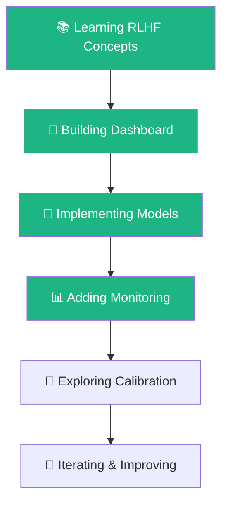

# 🤖 RLHF Loop System
### *Reinforcement Learning from Human Feedback Platform*

[](https://python.org)
[](https://typescriptlang.org)
[](https://streamlit.io)
[](https://huggingface.co/transformers)
[](LICENSE)

---

## 🎯 **Project Overview**

A **learning project** exploring Reinforcement Learning from Human Feedback (RLHF) concepts with a working dashboard for monitoring and analysis. Built as a hands-on exploration of ML operations, human feedback loops, and modern AI development practices.

### 🌟 **What's Included**

| Component | Description | Status |
|-----------|-------------|--------|
| 🎛️ **Pipeline Dashboard** | 4-phase RLHF monitoring interface | ✅ Working |
| 🧠 **Vote Prediction** | Basic transformer-based preference modeling | 🔄 Learning |
| 📊 **Drift Detection** | Model performance monitoring concepts | 🔄 Exploring |
| ⚡ **Batch Processing** | Prompt processing pipeline | ✅ Functional |
| 🎯 **Calibration Analysis** | Confidence score exploration | 🔄 Learning |
| 🔄 **Training Concepts** | RLHF methodology implementation | 📚 Studying |

---

## 🏗️ **Learning Journey**

This project explores the complete RLHF pipeline through hands-on implementation:



---

## 🚀 **Quick Start**

### 📋 **Prerequisites**
```bash
Python 3.8+  |  Node.js 16+  |  Git
```

### ⚡ **Installation**
```bash
# Clone the repository
git clone https://github.com/Yousifus/rlhf_loop_humain.git
cd rlhf_loop_humain

# Install dependencies
pip install -r requirements.txt
npm install

# Launch the RLHF Pipeline Monitor
python scripts/run_dashboard.py
```

### 🎛️ **Dashboard Access**
```
🌐 Local:     http://localhost:8501
🔧 Interface: RLHF Pipeline Monitor (4-Phase Structure)
📊 Features:  Data Collection | Training | Evaluation | Deployment
🔍 Debug:     http://localhost:8501?debug=chat (Hidden chat interface)
```

---

## 📁 **Project Structure**

```
rlhf_loop_humain/
├── 🎨 web/              # Frontend components & interfaces
├── 🚀 scripts/          # Automation & deployment tools  
│   └── run_dashboard.py # Main RLHF Pipeline Monitor
├── 🧪 tests/            # Quality assurance & validation
├── ⚙️ config/           # Configuration management
├── 📚 docs/             # Technical documentation
├── 🤖 interface/        # Dashboard sections & components
│   ├── sections/        # 4-phase pipeline sections
│   └── components/      # Reusable UI components
├── 🧠 models/           # ML models & checkpoints
├── 📊 data/             # Training data & pipelines
├── 🛠️ utils/            # Core utilities & APIs
└── 📋 tasks/            # Task management system
```

---

## 🛠️ **Technology Stack**

### 🧠 **AI & Machine Learning**
- **🤗 Transformers** - BERT-based preference modeling
- **🔥 PyTorch** - Deep learning framework
- **📊 scikit-learn** - Model validation & metrics
- **📈 NumPy/Pandas** - Data processing & analysis

### 🎛️ **Dashboard & Visualization** 
- **🎨 Streamlit** - Web interface with HUMAIN styling
- **📊 Plotly** - Interactive data visualization
- **🎯 Matplotlib** - Statistical plotting
- **🎨 Custom CSS** - HUMAIN OS design system

### 🚀 **Development Tools**
- **🐍 Python 3.8+** - Core runtime environment
- **📝 TypeScript** - Type-safe frontend development
- **⚡ PowerShell** - Windows automation scripts
- **🔧 Git** - Version control & collaboration

### 🔗 **AI API Integration**
- **🤖 DeepSeek** - Language model API
- **🧠 OpenAI** - GPT model integration
- **🏠 LM Studio** - Local model deployment
- **🔄 RESTful APIs** - Standardized integrations

---

## 📊 **RLHF Pipeline Monitor**

### 🏭 **4-Phase Dashboard Structure**
The dashboard explores the RLHF pipeline lifecycle:

#### **📊 Phase 1: Data Collection**
- **Data Ingestion** - Understanding data flow concepts
- **Annotation Interface** - Human feedback collection
- **Quality Metrics** - Data validation exploration

#### **🚀 Phase 2: Training**
- **Training Visualization** - Progress monitoring concepts
- **Loss Analysis** - Learning curve exploration
- **Resource Monitoring** - System performance tracking

#### **🎯 Phase 3: Evaluation**
- **Performance Analysis** - Model evaluation methods
- **Calibration Studies** - Confidence alignment research
- **Drift Detection** - Change monitoring concepts

#### **🌐 Phase 4: Deployment**
- **System Monitoring** - Operational status display
- **Health Checks** - System validation
- **Performance Tracking** - Basic metrics collection

### 🎨 **HUMAIN OS Design System**
- **Primary Color:** `#1DB584` (HUMAIN Teal)
- **Clean Interface:** Professional white backgrounds
- **Responsive Layout** - Mobile-friendly design
- **Performance Optimized** - Fast loading times

---

## 🎯 **Learning Applications**

### 📚 **Educational Use Cases**
- **RLHF Methodology** - Hands-on learning of human feedback concepts
- **ML Operations** - Understanding model monitoring and deployment
- **Dashboard Development** - Building data visualization interfaces
- **API Integration** - Working with modern AI services

### 🔬 **Research Exploration**  
- **Human Preference Learning** - Understanding preference modeling
- **Model Calibration** - Exploring confidence estimation
- **Drift Detection** - Learning about model degradation
- **Active Learning** - Efficient annotation strategies

---

## 📊 **Current Progress**

This is a learning project with working components:

| Component | Status | Description |
|-----------|---------|-------------|
| 📱 **Dashboard Interface** | ✅ Working | 4-phase monitoring interface with HUMAIN styling |
| 🗄️ **Data Management** | ✅ Basic | File-based data storage and loading |
| 🤖 **API Integration** | ✅ Working | DeepSeek/OpenAI API connections |
| 📊 **Visualizations** | ✅ Basic | Charts and metrics display |
| 🧠 **Model Training** | 🔄 Learning | Basic transformer implementation |
| 📈 **Performance Tracking** | 📚 Concept | Understanding metrics and monitoring |

*Note: This is a learning project, not a production system. Metrics and performance data are for educational exploration.*

---

## 🚀 **Getting Started**

### 🎛️ **Run the Dashboard**
```bash
# Launch the main dashboard
python scripts/run_dashboard.py

# With API key setup (guided in-dashboard)
# 1. Open http://localhost:8501
# 2. Configure DeepSeek API key in sidebar
# 3. Explore all 4 pipeline phases

# Debug mode with chat interface
http://localhost:8501?debug=chat
```

### 🧠 **Explore Model Components**
```bash
# Prepare training data
python utils/vote_predictor/data_prep.py

# Train preference model
python scripts/train_reward_model.py

# Calibrate confidence scores
python utils/vote_predictor/calibrate.py
```

### 🔍 **Run Tests**
```bash
# Run test suite
python -m pytest tests/ -v

# Validate data connections
python tests/test_data_connections.py

# Check model performance
python tests/test_reflection_data.py
```

---

## 🛡️ **Features**

### 🔐 **Security & Privacy**
- **🔒 API Integration** - In-dashboard key management
- **📝 Audit Logging** - Activity tracking
- **🛡️ Data Protection** - Privacy-focused design

### 📊 **Monitoring & Analytics**
- **📈 Dashboard Interface** - 4-phase pipeline visualization
- **🚨 Basic Alerts** - Simple issue detection
- **📋 Data Display** - Performance insights
- **🔍 Analysis Tools** - System exploration

### ⚡ **Technical Features**
- **🚀 Batch Processing** - Efficient data operations
- **📊 Memory Management** - Resource optimization
- **⚡ Caching Systems** - Response time optimization

---

## 📚 **Documentation**

| Resource | Description | Link |
|----------|-------------|------|
| 🏗️ **Architecture Guide** | System design & components | [`docs/architecture.md`](docs/architecture.md) |
| 🚀 **Deployment Guide** | Setup instructions | [`docs/DEPLOYMENT.md`](docs/DEPLOYMENT.md) |
| 🧪 **Testing Guide** | QA procedures & validation | [`tests/README.md`](tests/README.md) |

---

## 🤝 **Contributing**

This is a learning project! Contributions, suggestions, and improvements are welcome.

### 🛠️ **Development Setup**
```bash
# Fork the repository
git clone https://github.com/yourusername/rlhf_loop_humain.git

# Create feature branch
git checkout -b feature/amazing-feature

# Install development dependencies
pip install -r requirements.txt

# Run tests
python -m pytest tests/
```

---

## 📄 **License**

This project is licensed under the MIT License - see the [LICENSE](LICENSE) file for details.

---

## 🙏 **Acknowledgments**

- **🤗 Hugging Face** - Transformers library and model ecosystem
- **🎨 Streamlit** - Web application framework  
- **🔥 PyTorch** - Deep learning platform
- **🧠 OpenAI** - RLHF methodology research
- **🤖 Claude (Anthropic)** - AI pair programming assistance

---

## 📞 **Contact**

- **👨‍💻 Developer:** Yousifus
- **📧 Email:** [yoawlaki@gmail.com](mailto:yoawlaki@gmail.com)
- **🐙 GitHub:** [@Yousifus](https://github.com/Yousifus)
- **🔗 Repository:** [rlhf_loop_humain](https://github.com/Yousifus/rlhf_loop_humain)

---

<div align="center">

### 🌟 **Built with ❤️ for AI Research & Development** 🌟

*Learning RLHF concepts through hands-on implementation*

[](https://github.com/Yousifus/rlhf_loop_humain/stargazers)
[](https://github.com/Yousifus/rlhf_loop_humain/network/members)

</div>
