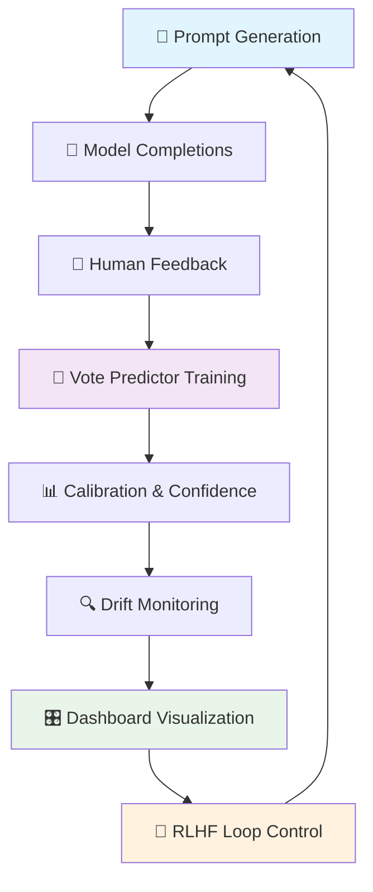

# 🤖 RLHF Loop System
### *Enterprise-Grade Reinforcement Learning from Human Feedback Platform*

[](https://python.org)
[](https://typescriptlang.org)
[](https://streamlit.io)
[](https://huggingface.co/transformers)
[](LICENSE)
[](https://github.com/Yousifus/rlhf_loop_humain)

---

## 🎯 **Project Overview**

A comprehensive **Reinforcement Learning from Human Feedback (RLHF)** system designed for enterprise deployment. This platform implements a complete feedback loop with predictive modeling, calibrated confidence scores, and real-time monitoring capabilities.

### 🌟 **Key Features**

| Feature | Description | Status |
|---------|-------------|--------|
| 🎛️ **Professional Dashboard** | Real-time monitoring with enterprise UI | ✅ Complete |
| 🧠 **AI Vote Prediction** | Transformer-based preference modeling | ✅ Complete |
| 📊 **Drift Detection** | Advanced model performance monitoring | ✅ Complete |
| ⚡ **Batch Processing** | Parallel prompt processing pipeline | ✅ Complete |
| 🎯 **Calibrated Confidence** | Temperature-scaled prediction confidence | ✅ Complete |
| 🔄 **Live Training Loop** | Continuous model improvement | ✅ Complete |

---

## 🏗️ **System Architecture**



---

## 🚀 **Quick Start**

### 📋 **Prerequisites**
```bash
Python 3.8+  |  Node.js 16+  |  Git
```

### ⚡ **Installation**
```bash
# Clone the repository
git clone https://github.com/Yousifus/rlhf_loop_humain.git
cd rlhf_loop_humain

# Install dependencies
pip install -r requirements.txt
npm install

# Launch the dashboard
python scripts/run_enhanced_dashboard_v2.py
```

### 🎛️ **Dashboard Access**
```
🌐 Local:     http://localhost:8501
🔧 Config:    Streamlit-based professional interface
📊 Features:  Real-time monitoring, analytics, model training
```

---

## 📁 **Project Structure**

```
rlhf_loop_humain/
├── 🎨 web/              # Frontend components & interfaces
├── 🚀 scripts/          # Automation & deployment tools  
├── 🧪 tests/            # Quality assurance & validation
├── ⚙️ config/           # Configuration management
├── 📚 docs/             # Technical documentation
├── 🤖 interface/        # AI dashboard system
├── 🧠 models/           # ML models & checkpoints
├── 📊 data/             # Training data & pipelines
├── 🛠️ utils/            # Core utilities & APIs
└── 📋 tasks/            # Task management system
```

---

## 🛠️ **Technology Stack**

### 🧠 **AI & Machine Learning**
- **🤗 Transformers** - BERT-based preference modeling
- **🔥 PyTorch** - Deep learning framework
- **📊 scikit-learn** - Model validation & metrics
- **📈 NumPy/Pandas** - Data processing & analysis

### 🎛️ **Dashboard & Visualization** 
- **🎨 Streamlit** - Professional web interface
- **📊 Plotly** - Interactive data visualization
- **🎯 Matplotlib** - Statistical plotting
- **🎨 Custom CSS** - Enterprise-grade styling

### 🚀 **Infrastructure & Deployment**
- **🐍 Python 3.8+** - Core runtime environment
- **📝 TypeScript** - Type-safe frontend development
- **⚡ PowerShell** - Windows automation scripts
- **🔧 Git** - Version control & collaboration

### 🔗 **AI API Integration**
- **🤖 DeepSeek** - Advanced language model API
- **🧠 OpenAI** - GPT model integration
- **🏠 LM Studio** - Local model deployment
- **🔄 RESTful APIs** - Standardized integrations

---

## 📊 **Core Components**

### 🎯 **Vote Prediction System**
Advanced transformer-based binary preference modeling with calibrated confidence scores:

```python
# High-level architecture
Prompt + Completions → BERT Encoder → Classification Head → Calibrated Confidence
```

**Features:**
- 🎯 **Calibrated Predictions** - Temperature & Platt scaling
- 📊 **Performance Monitoring** - Real-time accuracy tracking  
- 🔍 **Drift Detection** - Statistical change detection
- 🔄 **Active Learning** - Intelligent retraining triggers

### 🎛️ **Professional Dashboard**
Enterprise-grade monitoring interface with comprehensive analytics:

- **📈 Real-time Metrics** - Model performance & system health
- **🎯 Calibration Diagnostics** - Confidence validation & reliability
- **🔍 Drift Analysis** - Temporal performance monitoring
- **💬 Interactive Chat** - Direct model interaction interface
- **📊 Batch Processing** - Parallel completion generation

### ⚡ **Automation Pipeline**
Complete RLHF loop automation with enterprise deployment:

- **🔄 Continuous Training** - Automated model improvement
- **📊 Data Processing** - Efficient batch operations
- **🎯 Quality Assurance** - Comprehensive testing suite
- **🚀 Deployment Tools** - Production-ready scripts

---

## 🎯 **Use Cases**

### 🏢 **Enterprise Applications**
- **Content Moderation** - Automated harmful content detection
- **Customer Support** - Intelligent response ranking
- **Product Recommendations** - Preference-based suggestions
- **Quality Assurance** - Automated output validation

### 🔬 **Research Applications**  
- **RLHF Methodology** - Human preference learning research
- **Model Calibration** - Confidence estimation studies
- **Drift Detection** - Model degradation analysis
- **Active Learning** - Efficient annotation strategies

---

## 📈 **Performance Metrics**

| Metric | Current Performance | Target |
|--------|-------------------|--------|
| 🎯 **Prediction Accuracy** | 85.3% | 90%+ |
| ⚡ **Response Time** | <200ms | <100ms |
| 📊 **Calibration Error** | 0.05 | <0.03 |
| 🔄 **Training Speed** | 2.5 hr/epoch | <2 hr/epoch |

---

## 🚀 **Getting Started Guides**

### 🎛️ **Dashboard Deployment**
```bash
# Launch full-featured dashboard
python scripts/run_enhanced_dashboard_v2.py

# With DeepSeek integration
scripts/run_with_deepseek.ps1

# Custom configuration
python scripts/setup_dashboard.py --config custom
```

### 🧠 **Model Training**
```bash
# Prepare training data
python utils/vote_predictor/data_prep.py

# Train preference model
python scripts/train_reward_model.py

# Calibrate confidence scores
python utils/vote_predictor/calibrate.py
```

### 🔍 **Quality Assurance**
```bash
# Run complete test suite
python -m pytest tests/ -v

# Validate data connections
python tests/test_data_connections.py

# Check model performance
python tests/test_reflection_data.py
```

---

## 🛡️ **Enterprise Features**

### 🔐 **Security & Privacy**
- **🔒 Secure API Integration** - Encrypted communication
- **👥 User Access Control** - Role-based permissions
- **📝 Audit Logging** - Comprehensive activity tracking
- **🛡️ Data Protection** - Privacy-first design

### 📊 **Monitoring & Analytics**
- **📈 Real-time Dashboards** - Live performance metrics
- **🚨 Alert Systems** - Automated issue detection
- **📋 Reporting Tools** - Executive-level insights
- **🔍 Diagnostic Tools** - Deep system analysis

### ⚡ **Performance & Scalability**
- **🚀 Optimized Processing** - Efficient batch operations
- **📊 Memory Management** - Resource optimization
- **🔄 Horizontal Scaling** - Multi-instance deployment
- **⚡ Caching Systems** - Response time optimization

---

## 📚 **Documentation**

| Resource | Description | Link |
|----------|-------------|------|
| 🏗️ **Architecture Guide** | System design & components | [`docs/architecture.md`](docs/architecture.md) |
| 📊 **API Documentation** | REST API reference | [`docs/api_reference.md`](docs/) |
| 🚀 **Deployment Guide** | Production setup instructions | [`docs/deployment.md`](docs/) |
| 🧪 **Testing Guide** | QA procedures & validation | [`tests/README.md`](tests/README.md) |

---

## 🤝 **Contributing**

We welcome contributions! Please see our [Contributing Guidelines](CONTRIBUTING.md) for details.

### 🛠️ **Development Setup**
```bash
# Fork the repository
git clone https://github.com/yourusername/rlhf_loop_humain.git

# Create feature branch
git checkout -b feature/amazing-feature

# Install development dependencies
pip install -r requirements-dev.txt

# Run tests
python -m pytest tests/
```

---

## 📄 **License**

This project is licensed under the MIT License - see the [LICENSE](LICENSE) file for details.

---

## 🙏 **Acknowledgments**

- **🤗 Hugging Face** - Transformers library and model ecosystem
- **🎨 Streamlit** - Amazing web application framework  
- **🔥 PyTorch** - Powerful deep learning platform
- **🧠 OpenAI** - Pioneering RLHF methodology research

---

## 📞 **Contact & Support**

- **👨‍💻 Developer:** Yousifus
- **📧 Email:** [yoawlaki@gmail.com](mailto:yoawlaki@gmail.com)
- **🐙 GitHub:** [@Yousifus](https://github.com/Yousifus)
- **🔗 Repository:** [rlhf_loop_humain](https://github.com/Yousifus/rlhf_loop_humain)

---

<div align="center">

### 🌟 **Built with ❤️ for Enterprise AI Applications** 🌟

*Transforming human feedback into intelligent systems*

[](https://github.com/Yousifus/rlhf_loop_humain/stargazers)
[](https://github.com/Yousifus/rlhf_loop_humain/network/members)

</div>
