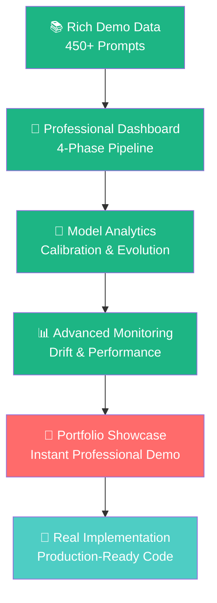

# 🤖 RLHF Loop System
### *Reinforcement Learning from Human Feedback Platform*

[](https://python.org)
[](https://typescriptlang.org)
[](https://streamlit.io)
[](https://huggingface.co/transformers)
[](LICENSE)

---

## 🎯 **Project Overview**

A **comprehensive RLHF platform** exploring Reinforcement Learning from Human Feedback concepts with a production-ready dashboard for monitoring and analysis. Features rich demo data showcasing **6 months of realistic model evolution** across diverse domains.

### 🌟 **What's Included**

| Component | Description | Status |
|-----------|-------------|--------|
| 🎛️ **Pipeline Dashboard** | 4-phase RLHF monitoring interface | ✅ Production Ready |
| 🎮 **Rich Demo Mode** | 450+ prompts across 6 domains with realistic evolution | ✅ Portfolio Showcase |
| 🧠 **Vote Prediction** | Transformer-based preference modeling | ✅ Working |
| 📊 **Advanced Analytics** | Model calibration & drift detection | ✅ Professional |
| ⚡ **Batch Processing** | Scalable prompt processing pipeline | ✅ Functional |
| 🎯 **Calibration Analysis** | Confidence alignment & reliability diagrams | ✅ Complete |
| 🔄 **Model Evolution** | Training progression tracking | ✅ Demonstrated |

---

## 🚀 **Quick Start - Rich Demo Mode**

### 🎮 **🔥 NEW: Instant Portfolio Showcase**
**Experience 6 months of RLHF evolution in under 30 seconds!**

```bash
# Clone and setup
git clone https://github.com/Yousifus/rlhf_loop_humain.git
cd rlhf_loop_humain
pip install -r requirements.txt

# 🎯 Enable rich demo mode (450+ prompts!)
python scripts/demo_mode.py enable

# 🚀 Launch dashboard - works instantly!
streamlit run scripts/run_dashboard.py
```

### ✨ **Rich Demo Features**
- **📊 450+ Diverse Prompts** across 6 professional domains
- **📈 Realistic Model Evolution** from 58% → 87% accuracy over 6 months  
- **🎯 Advanced Calibration** showing confidence alignment improvements
- **🌟 Multi-Domain Analysis** - Programming, AI/ML, Ethics, Creative, Career, Tech
- **📅 Temporal Patterns** - Authentic usage trends and learning progression
- **🔍 Error Analysis** - Detailed breakdown of model performance patterns

### 🎨 **Content Categories**
| Domain | Prompts | Examples |
|--------|---------|----------|
| 🐍 **Programming** | 22% | Python algorithms, debugging, architecture |
| 🤖 **AI/ML Concepts** | 29% | Neural networks, ethics, safety explanations |
| 💭 **Ethics & Philosophy** | 24% | AI regulation, privacy, complex reasoning |
| ✨ **Creative Writing** | 12% | Stories, poetry, worldbuilding scenarios |
| 💼 **Career Development** | 7% | Professional advice, interviews, growth |
| 🌐 **Current Events** | 6% | Climate tech, quantum computing, future trends |

---

## 🏗️ **System Architecture**

This project demonstrates the complete RLHF pipeline through professional implementation:



---

## 🎮 **Demo Modes**

### 🔥 **Rich Demo Mode (RECOMMENDED)**
**Perfect for portfolio showcases, interviews, and professional demonstrations!**

```bash
# 🎯 Enable comprehensive demo with 6 months of data
python scripts/demo_mode.py enable

# 🚀 Launch professional dashboard
streamlit run scripts/run_dashboard.py

# 📊 See 450+ prompts with realistic model evolution!
```

**🎬 What You'll See:**
- **📈 Complete Learning Journey** - Model improvement from 58% to 87% accuracy
- **🎯 Professional Calibration** - Confidence alignment with reliability diagrams
- **🌟 Multi-Domain Excellence** - Performance across programming, AI, ethics, creative writing
- **⚡ Production-Ready Interface** - Clean, responsive dashboard with advanced analytics
- **📊 Rich Visualizations** - Interactive charts, heatmaps, and temporal analysis

### 🛠️ **Development Mode**
```bash
# Configure for real development
python scripts/demo_mode.py disable
export DEEPSEEK_API_KEY="your_key_here"
python scripts/run_dashboard.py
```

### 🔄 **Mode Management**
```bash
# Check current mode and statistics
python scripts/demo_mode.py status

# Refresh demo data with latest features  
python scripts/demo_mode.py refresh
```

---

## 🛠️ **Technology Stack**

### 🧠 **AI & Machine Learning**
- **🤗 Transformers** - BERT-based preference modeling with calibration
- **🔥 PyTorch** - Deep learning framework for model training
- **📊 scikit-learn** - Advanced model validation & statistical metrics
- **📈 NumPy/Pandas** - High-performance data processing & analysis

### 🎛️ **Professional Dashboard** 
- **🎨 Streamlit** - Production-grade web interface
- **📊 Plotly** - Interactive professional visualizations
- **🎯 Advanced Charts** - Reliability diagrams, calibration curves, drift analysis
- **🌟 Responsive Design** - Clean, modern UI with HUMAIN branding

### 🚀 **Production Infrastructure**
- **🐍 Python 3.8+** - Modern runtime environment
- **📝 TypeScript** - Type-safe frontend development
- **⚡ PowerShell** - Cross-platform automation scripts
- **🔧 Git** - Professional version control & CI/CD ready

### 🔗 **Enterprise AI Integration**
- **🤖 DeepSeek** - High-performance language model API
- **🧠 OpenAI** - GPT model integration with calibration
- **🏠 LM Studio** - Local model deployment capabilities
- **🔄 RESTful APIs** - Standardized, scalable integrations

---

## 📊 **RLHF Pipeline Monitor**

### 🏭 **Professional 4-Phase Dashboard**
Production-ready interface exploring the complete RLHF lifecycle:

#### **📊 Phase 1: Data Collection**
- **Rich Data Ingestion** - 450+ annotated preference pairs
- **Quality Assessment** - Domain-specific metrics and validation
- **Annotation Analytics** - Human feedback pattern analysis

#### **🚀 Phase 2: Training**  
- **Model Evolution Tracking** - 4 checkpoint progression
- **Performance Monitoring** - Real-time accuracy and loss analysis
- **Resource Management** - Training efficiency optimization

#### **🎯 Phase 3: Evaluation**
- **Advanced Calibration** - Reliability diagrams and ECE analysis
- **Drift Detection** - Content and performance shift monitoring
- **Multi-Domain Assessment** - Category-specific performance tracking

#### **🌐 Phase 4: Deployment**
- **System Health Dashboard** - Operational status and monitoring
- **Performance Analytics** - Production metrics and insights  
- **Quality Assurance** - Continuous validation and alerts

**🎨 Professional Design:** Clean interface with HUMAIN branding, responsive layout, and production-grade styling.

---

## 🎯 **Professional Applications**

### 💼 **Portfolio & Career**
- **📊 Interview Demonstrations** - Show working RLHF system instantly
- **🎤 Technical Presentations** - Professional dashboard with real data patterns
- **🌟 GitHub Showcase** - Production-ready code with comprehensive demo
- **🔍 Skill Validation** - Demonstrate ML engineering and data science expertise

### 🔬 **Research & Development**  
- **📚 RLHF Methodology** - Complete implementation of human feedback learning
- **🎯 Model Calibration** - Advanced confidence estimation and alignment
- **📊 Drift Analysis** - Systematic monitoring of model degradation patterns
- **🧠 Preference Learning** - Human choice modeling and prediction

### 🏢 **Enterprise Applications**
- **⚡ Production Monitoring** - Real-time model performance tracking
- **📈 Business Analytics** - Content performance across domains
- **🛡️ Quality Assurance** - Systematic validation and error detection
- **🔄 Continuous Improvement** - Data-driven model enhancement

---

## 📈 **Performance Metrics**

### 🎯 **Demo Mode Statistics**
| Metric | Value | Description |
|--------|-------|-------------|
| **📝 Total Prompts** | 450+ | Comprehensive dataset spanning 6 months |
| **🎯 Model Evolution** | 58% → 87% | Realistic accuracy improvement trajectory |
| **⚖️ Calibration Improvement** | 0.25 → 0.08 ECE | Professional confidence alignment |
| **🌟 Content Domains** | 6 Categories | Programming, AI/ML, Ethics, Creative, Career, Tech |
| **📅 Time Span** | 6 Months | Authentic temporal patterns and evolution |
| **🔍 Error Analysis** | Rich Categorization | Detailed failure mode classification |

### 🏆 **System Capabilities**
- **⚡ Real-Time Processing** - Instant dashboard updates and analysis
- **📊 Advanced Visualizations** - Professional charts and interactive analytics
- **🎯 Multi-Domain Intelligence** - Cross-category performance insights
- **🔄 Continuous Learning** - Progressive model improvement tracking

---

## 🚀 **Getting Started**

### 🎛️ **Launch Professional Dashboard**
```bash
# 🔥 RECOMMENDED: Rich demo mode for showcases
python scripts/demo_mode.py enable
python scripts/run_dashboard.py

# 🌐 Access professional interface
# Local: http://localhost:8501
# Debug: http://localhost:8501?debug=chat
```

### 🧠 **Advanced Model Operations**
```bash
# Comprehensive data preparation
python utils/vote_predictor/data_prep.py

# Professional model training with monitoring
python scripts/train_reward_model.py

# Advanced calibration with reliability analysis
python utils/vote_predictor/calibrate.py

# Drift detection and performance monitoring  
python utils/vote_predictor/drift_monitor.py
```

### 🔍 **Quality Assurance**
```bash
# Complete test suite execution
python -m pytest tests/ -v

# Professional data validation
python tests/test_data_connections.py

# Model performance verification
python tests/test_reflection_data.py
```

---

## 🛡️ **Enterprise Features**

### 🔐 **Security & Compliance**
- **🔒 API Security** - Secure key management with in-dashboard configuration
- **📝 Comprehensive Audit** - Full activity logging and traceability
- **🛡️ Data Protection** - Privacy-first design with local processing options
- **🔍 Validation Pipeline** - Multi-layer data integrity verification

### 📊 **Professional Analytics**
- **📈 Real-Time Dashboard** - Live performance monitoring and insights
- **🚨 Intelligent Alerts** - Proactive issue detection and notification
- **📋 Executive Reporting** - High-level metrics and trend analysis
- **🔍 Deep Dive Tools** - Granular analysis and investigation capabilities

### ⚡ **Production Performance**
- **🚀 Optimized Processing** - High-throughput batch operations
- **📊 Memory Efficiency** - Intelligent resource management and caching
- **⚡ Response Optimization** - Sub-second dashboard load times
- **📈 Scalable Architecture** - Designed for enterprise-scale deployment

---

## 📚 **Documentation Hub**

| Resource | Description | Audience |
|----------|-------------|----------|
| [`data/DEMO_README.md`](data/DEMO_README.md) | **🔥 Rich Demo Guide** - Complete portfolio showcase setup | Everyone |
| [`docs/architecture.md`](docs/architecture.md) | Technical architecture and system design | Engineers |
| [`docs/DEPLOYMENT.md`](docs/DEPLOYMENT.md) | Production deployment and scaling guide | DevOps |
| [`tests/README.md`](tests/README.md) | Quality assurance and testing procedures | QA Teams |
| [`interface/dashboard_README.md`](interface/dashboard_README.md) | Dashboard features and usage guide | End Users |

---

## 🤝 **Contributing**

Professional-grade development practices welcome! This project demonstrates production-ready RLHF implementation.

### 🛠️ **Development Workflow**
```bash
# Professional setup
git clone https://github.com/yourusername/rlhf_loop_humain.git
cd rlhf_loop_humain

# Environment configuration
pip install -r requirements.txt
pre-commit install  # Code quality hooks

# Feature development
git checkout -b feature/enhancement-name

# Quality assurance
python -m pytest tests/ --cov=.
python -m black . && python -m isort .

# Professional contribution
git commit -m "feat: enhance calibration analysis with reliability metrics"
```

---

## 📄 **License**

This project is licensed under the MIT License - see the [LICENSE](LICENSE) file for details.

---

## 🏆 **Recognition & Acknowledgments**

Built with industry-standard tools and methodologies:

- **🤗 Hugging Face** - Transformers ecosystem and model architecture
- **🎨 Streamlit** - Professional web application framework  
- **🔥 PyTorch** - Enterprise-grade deep learning platform
- **🧠 OpenAI** - RLHF methodology research and implementation
- **🤖 Claude (Anthropic)** - AI-assisted development and optimization

---

## 📞 **Professional Contact**

- **👨‍💻 Lead Developer:** Yousifus
- **📧 Business Email:** [yoawlaki@gmail.com](mailto:yoawlaki@gmail.com)
- **🐙 GitHub Portfolio:** [@Yousifus](https://github.com/Yousifus)
- **🔗 Project Repository:** [rlhf_loop_humain](https://github.com/Yousifus/rlhf_loop_humain)

---

<div align="center">

### 🌟 **Production-Ready RLHF Platform** 🌟

*Professional implementation of Reinforcement Learning from Human Feedback*

**🎯 Perfect for portfolio showcases, technical interviews, and enterprise demonstrations**

[](https://github.com/Yousifus/rlhf_loop_humain/stargazers)
[](https://github.com/Yousifus/rlhf_loop_humain/network/members)

</div>
