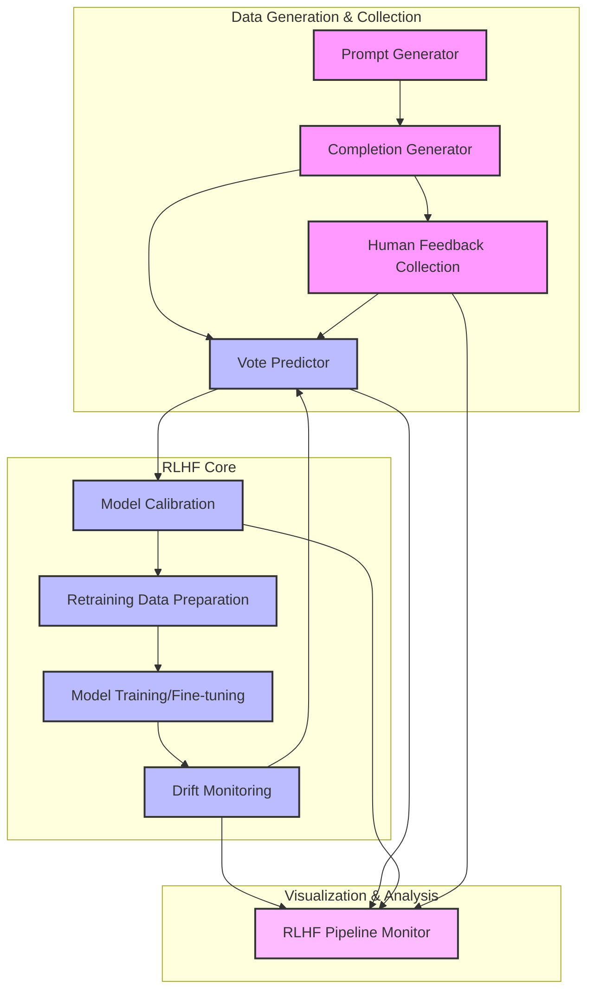
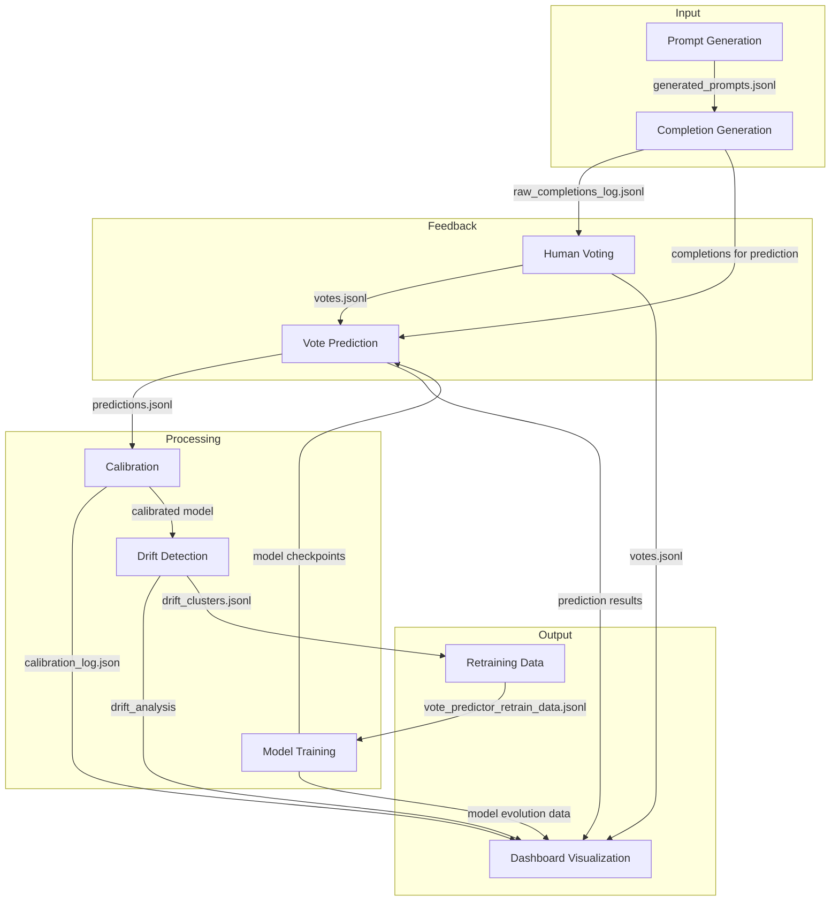
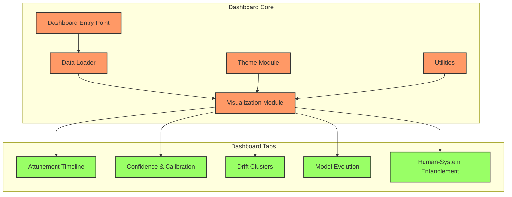
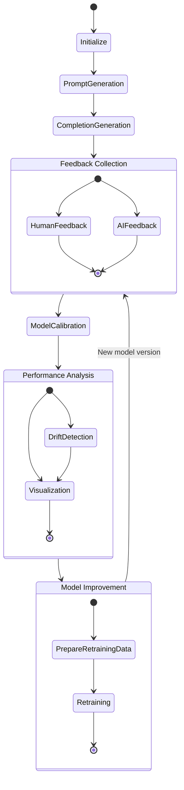
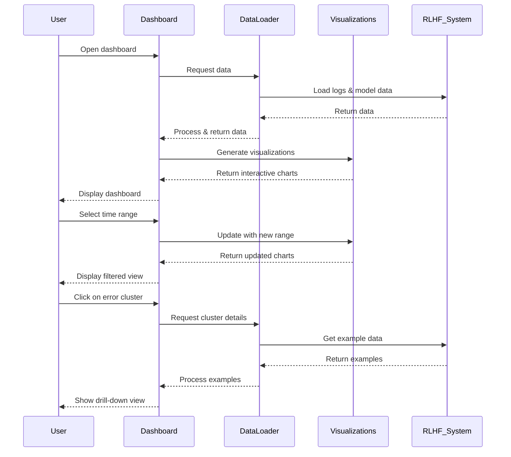

# RLHF System Architecture

This document provides a visualization of the RLHF Loop system architecture using Mermaid diagrams. It shows the component relationships, data flow, and implementation structure.

## System Components

## Data Flow Diagram

## Dashboard Architecture

## Directory Structure

```mermaid
graph TD
    subgraph "RLHF Loop Project"
        ROOT[Root Directory] --> DATA[data/]
        ROOT --> DOCS[docs/]
        ROOT --> INTERFACE[interface/]
        ROOT --> MODELS[models/]
        ROOT --> PROMPTS[prompts/]
        ROOT --> TASKS[tasks/]
        ROOT --> UTILS[utils/]
        ROOT --> SCRIPTS[scripts/]
        ROOT --> CONFIG[configuration files]
    end
    
    DATA --> D1[votes.jsonl]
    DATA --> D2[raw_completions_log.jsonl]
    DATA --> D3[predictions.jsonl]
    DATA --> D4[vote_predictor_training_data.jsonl]
    
    DOCS --> DOC1[architecture.md]
    DOCS --> DOC2[visualization_reference.md]
    
    INTERFACE --> I1[voting_ui.py]
    INTERFACE --> I2[rlhf_loop.py]
    INTERFACE --> I3[eval_probe.py]
    INTERFACE --> I4[run_drift_analysis.py]
    INTERFACE --> I5[scripts/run_dashboard.py]
    
    MODELS --> M1[vote_predictor_checkpoint/]
    MODELS --> M2[meta_reflection_log.jsonl]
    MODELS --> M3[calibration_log.json]
    MODELS --> M4[drift_analysis/]
    
    PROMPTS --> P1[generator.py]
    PROMPTS --> P2[generated_prompts.jsonl]
    
    UTILS --> U1[completions.py]
    UTILS --> U2[vote_predictor/]
    UTILS --> U3[batch_processor.py]
    
    U2 --> VP1[data_prep.py]
    U2 --> VP2[train.py]
    U2 --> VP3[calibrate.py]
    U2 --> VP4[predict.py]
    U2 --> VP5[retrain_data_prep.py]
    U2 --> VP6[drift_monitor.py]
    
    TASKS --> T1[task_001.txt]
    TASKS --> T2[task_002.txt]
    TASKS --> T3[tasks.json]
    
    SCRIPTS --> S1[prd.txt]
    
    CONFIG --> C1[.taskmasterconfig]
    CONFIG --> C2[requirements.txt]
```

## System Lifecycle

## Dashboard Component Interaction

This architecture documentation provides a comprehensive visual overview of the RLHF Loop system structure, component relationships, and information flow. Use these diagrams as a reference for understanding the system design and implementation approach. 