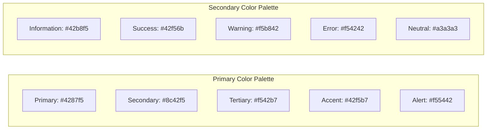

# RLHF Dashboard Visualization Reference

This document serves as a visual reference for the implementation of the RLHF Attunement Dashboard. It provides examples of visualization styles, chart types, and interaction patterns to maintain consistency across the dashboard components.

## Design Philosophy

The dashboard follows a "symbolic organism" metaphor, treating the RLHF system as a living entity that evolves and adapts over time. This metaphor informs the visualization choices and interaction patterns throughout the dashboard.

### Color Schemes

The dashboard supports both light and dark themes with a consistent color palette:



## Attunement Timeline Tab

The Attunement Timeline tab visualizes the temporal aspects of model behavior and calibration events.

### Main Visualization: Accuracy & Calibration Over Time

```
┌─────────────────────────────────────────────────────┐
│                                                     │
│ Accuracy (%)     ┌─┐                               │
│ 100 ┼────────────┘ └───────────────────┐           │
│  90 ┼                                   └──┐        │
│  80 ┼                                      └────────│
│  70 ┼                                                │
│  60 ┼                                                │
│     └─────────────────────────────────────────────┘ │
│     Jan    Feb    Mar    Apr    May    Jun    Jul   │
│                                                     │
│     ▲       ▲             ▲                  ▲      │
│     │       │             │                  │      │
│     │       │             │                  │      │
│  Calibration Events      Drift Alerts  Model Updates │
└─────────────────────────────────────────────────────┘
```

### Interactive Elements

- Zoom and pan time range
- Toggle between different metrics (Accuracy, ECE, Brier score)
- Click on events for detailed information
- Filter by event type

## Confidence & Calibration Tab

This tab focuses on the system's "cognitive thermoregulation" - how well its confidence aligns with its accuracy.

### Main Visualization: Reliability Diagram

```
┌─────────────────────────────────────────────────────┐
│                                                     │
│ Observed      │                              ●      │
│ Accuracy (%)  │                         ●           │
│ 100 ┼─────────────────────────────────────────●────│
│  80 ┼────────────────────────────●───────────────  │
│  60 ┼───────────────────●───────────────────────   │
│  40 ┼──────────●───────────────────────────────    │
│  20 ┼───●────────────────────────────────────      │
│   0 ┼─●───────────────────────────────────────     │
│     └─────────────────────────────────────────────┘ │
│      0  10  20  30  40  50  60  70  80  90  100     │
│               Predicted Confidence (%)              │
│                                                     │
│     Perfect Calibration: ───                        │
│     Current Model: ● ● ●                            │
└─────────────────────────────────────────────────────┘
```

### Confidence vs Correctness Heatmap

```
┌─────────────────────────────────────────────────────┐
│                                                     │
│ Confidence (%)                                      │
│ 100 ┼───────┬───────┬───────┬───────┬───────┐      │
│  80 ┼───────┼───────┼───────┼───────┼───────┤      │
│  60 ┼───────┼───────┼───────┼───────┼───────┤      │
│  40 ┼───────┼───────┼───────┼───────┼───────┤      │
│  20 ┼───────┼───────┼───────┼───────┼───────┤      │
│   0 ┼───────┴───────┴───────┴───────┴───────┘      │
│      Legal  Tech  Creative Finance Medical          │
│                    Domain                           │
│                                                     │
│   ┌─────────────┐                                   │
│   │ % Correct   │                                   │
│   │ 0% ■        │                                   │
│   │ 25% ■       │                                   │
│   │ 50% ■       │                                   │
│   │ 75% ■       │                                   │
│   │ 100% ■      │                                   │
│   └─────────────┘                                   │
└─────────────────────────────────────────────────────┘
```

## Drift Clusters Tab

The Drift Clusters tab visualizes error patterns as "tissue fragmentation" in the symbolic organism.

### Main Visualization: UMAP/t-SNE Cluster View

```
┌─────────────────────────────────────────────────────┐
│                                                     │
│                    ○ ○                              │
│               ○    ○○○○    ○                        │
│            ○○○○○○○○○○○○○○○○○                       │
│           ○○○○○○○○○○○○○○○○○○○                      │
│            ○○○○○○○○○○○○○○○○○                       │
│                ○○○○○○○○○                           │
│                       △△△△                          │
│                     △△△△△△△△                        │
│                   △△△△△△△△△△△                       │
│                    △△△△△△△△                         │
│                       □□                            │
│                     □□□□□□                           │
│                    □□□□□□□□                          │
│                     □□□□□□                           │
│                                                     │
│   ┌───────────────────┐                             │
│   │ ○ Cluster 1 (64%) │                             │
│   │ △ Cluster 2 (23%) │                             │
│   │ □ Cluster 3 (13%) │                             │
│   └───────────────────┘                             │
└─────────────────────────────────────────────────────┘
```

### Cluster Entropy Over Time

```
┌─────────────────────────────────────────────────────┐
│                                                     │
│ Entropy                                             │
│   ┌───────────────────────────/\────────────────┐   │
│   │                          /  \               │   │
│   │                         /    \              │   │
│   │                        /      \             │   │
│   │          /\           /        \            │   │
│   │         /  \         /          \           │   │
│   │        /    \       /            \          │   │
│   │       /      \     /              \         │   │
│   │      /        \___/                \_____   │   │
│   │_____/                                       │   │
│   └───────────────────────────────────────────────┘ │
│      Jan  Feb  Mar  Apr  May  Jun  Jul  Aug  Sep    │
│                                                     │
│   ↑ Higher entropy = More fragmented clusters       │
└─────────────────────────────────────────────────────┘
```

## Model Evolution Tab

The Model Evolution tab visualizes the "symbolic anatomy" of different model versions.

### Main Visualization: Delta Metrics Between Versions

```
┌─────────────────────────────────────────────────────┐
│                                                     │
│  Metric         v1 → v2    v2 → v3    v3 → v4       │
│  ───────────────────────────────────────────────    │
│  Accuracy      +2.3%      -0.5%      +4.1%          │
│  ECE           -1.7%      +0.8%      -2.2%          │
│  Brier Score   -0.03      +0.01      -0.05          │
│  F1 Score      +0.04      -0.01      +0.06          │
│  AUC           +0.02      -0.00      +0.03          │
│                                                     │
│  ┌─────────────────────────────────────────────┐    │
│  │         ◀─── Worse    Better ───▶           │    │
│  │  Accuracy  ─────────────●─────────────      │    │
│  │  ECE       ───────●─────────────────        │    │
│  │  Brier     ────────────●──────────────      │    │
│  │  F1        ──────────●────────────────      │    │
│  │  AUC       ──────────────●────────────      │    │
│  └─────────────────────────────────────────────┘    │
└─────────────────────────────────────────────────────┘
```

### Side-by-Side Reliability Diagrams

```
┌─────────────────────────────────────────────────────┐
│ ┌───────────────────┐    ┌───────────────────┐      │
│ │      Model v3     │    │      Model v4     │      │
│ │                   │    │                   │      │
│ │ 100┼           ●  │    │ 100┼           ●  │      │
│ │  80┼        ●     │    │  80┼         ●    │      │
│ │  60┼      ●       │    │  60┼       ●      │      │
│ │  40┼    ●         │    │  40┼     ●        │      │
│ │  20┼  ●           │    │  20┼   ●          │      │
│ │   0┼●             │    │   0┼ ●            │      │
│ │    └─────────────┘     │    └─────────────┘      │
│ │     0   50    100      │     0   50    100       │
│ └───────────────────┘    └───────────────────┘      │
│                                                     │
│ ECE:       0.068              ECE:      0.042       │
│ Brier:     0.189              Brier:    0.142       │
│ Accuracy:  76.2%              Accuracy: 80.3%       │
└─────────────────────────────────────────────────────┘
```

## Human-System Entanglement Tab

This tab visualizes the integration of human preferences and system behavior.

### Main Visualization: Vote Timeline

```
┌─────────────────────────────────────────────────────┐
│                                                     │
│ Vote Count                                          │
│ 120 ┼──────────────────────────────────────────     │
│ 100 ┼───────────────────────────────────────────    │
│  80 ┼───────────────────────────────────────────────│
│  60 ┼──────────                  ────────────────── │
│  40 ┼──────                                         │
│  20 ┼───                                            │
│   0 ┼───────────────────────────────────────────────│
│     └────────────────────────────────────────────── │
│      Jan    Feb    Mar    Apr    May    Jun    Jul  │
│                                                     │
│      Human Votes: ───                               │
│      AI Predicted: - - -                            │
└─────────────────────────────────────────────────────┘
```

### Theme-Based Agreement Shifts

```
┌─────────────────────────────────────────────────────┐
│                                                     │
│ Agreement %                                         │
│ 100 ┼                                               │
│  90 ┼         ╱╲                                    │
│  80 ┼        ╱  ╲                    ╱╲             │
│  70 ┼───────╱    ╲──────────────────╱  ╲────────── │
│  60 ┼                                               │
│  50 ┼                                               │
│     └───────────────────────────────────────────────│
│      Legal  Tech  Creative Finance Medical Science  │
│                   Theme                             │
│                                                     │
│      Previous: ───                                  │
│      Current: ╱╲                                    │
└─────────────────────────────────────────────────────┘
```

## Interactive Elements Across All Tabs

All visualizations should support these common interactive elements:

1. **Tooltips** - Detailed information on hover
2. **Zooming and Panning** - For time-series and spatial visualizations
3. **Filtering** - By date range, domain, model version, etc.
4. **Drill-down** - From aggregate views to specific examples
5. **Export** - Save visualization as PNG/SVG or data as CSV

## Implementation Notes

When implementing these visualizations:

1. Use the Plotly Python library for interactive charts
2. Maintain consistent color schemes and interaction patterns
3. Ensure all visualizations have appropriate axis labels and legends
4. Optimize for performance with large datasets
5. Support both light and dark themes
6. Include accessibility features (colorblind-friendly palettes, text alternatives)
7. Implement responsive designs that work well on different screen sizes

## References

- [Plotly Python Documentation](https://plotly.com/python/)
- [UMAP Documentation](https://umap-learn.readthedocs.io/)
- [Streamlit Visualization Guide](https://docs.streamlit.io/library/api-reference/charts)
- [Information Visualization Best Practices](https://www.tableau.com/learn/articles/data-visualization-tips) 