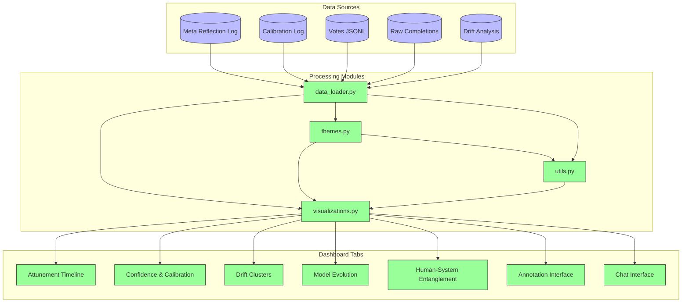
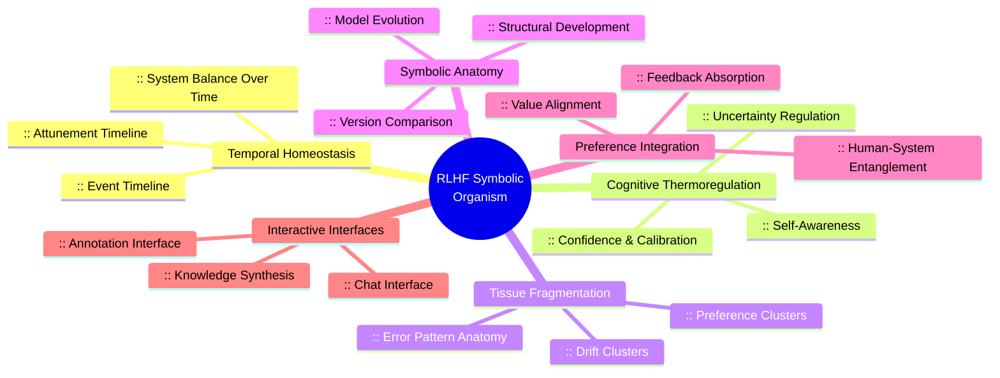

# Task Management Overview

This directory contains the tasks generated by Task Master for the RLHF Loop project. The tasks are organized hierarchically with dependencies and priorities to guide implementation.

## Task Structure Visualization

```mermaid
graph TD
    subgraph "Primary Tasks"
        T1[1: Setup Project Repository]
        T2[2: Implement Prompt Generation]
        T3[3: Integrate DeepSeek API]
        T4[4: Design Human Voting Interface]
        T5[5: Implement Vote Logging]
        T6[6: Train Preference Model]
        T7[7: Develop Dashboard]
        T8[8: Implement Drift Detection]
        T9[9: Integrate Meta-Reflection]
        T10[10: Test System Functionality]
        T11[11: Implement RLHF Dashboard]
        T20[20: Dashboard Performance Optimization]
        T21[21: Enhance Accessibility & Internationalization]
        T22[22: Comprehensive Documentation]
        T23[23: Deploy RLHF Dashboard]
        T24[24: Fix Dashboard Deprecation Warnings]
    end
    
    T1 --> T2
    T2 --> T3
    T3 --> T4
    T4 --> T5
    T5 --> T6
    T6 --> T7
    T7 --> T8
    T8 --> T9
    T9 --> T10
    T10 --> T11
    
    T11 --> T20
    T11 --> T21
    T11 --> T22
    T11 --> T24
    T20 --> T23
    T21 -.-> T23
    T22 -.-> T23
    T23 -.-> T20
    T24 -.-> T11
    
    classDef completed fill:#9f9,stroke:#333,stroke-width:1px;
    classDef inProgress fill:#fc9,stroke:#333,stroke-width:1px;
    classDef pending fill:#f99,stroke:#333,stroke-width:1px;
    classDef high fill:#f66,stroke:#333,stroke-width:2px;
    
    class T1,T2,T3,T11,T24 completed;
    class T4,T5,T6 inProgress;
    class T7,T8,T9,T10,T20,T21,T22 pending;
    class T23 high;
```

## RLHF Dashboard Implementation Details

Tasks 11-19 focus on implementing the RLHF Pipeline Monitor components, which have been successfully completed and consolidated into scripts/run_dashboard.py:

```mermaid
graph TD
    T11[11: Implement RLHF Dashboard] --> T12[12: Attunement Timeline Tab]
    T11 --> T13[13: Confidence & Calibration Tab]
    T11 --> T14[14: Drift Clusters Tab]
    T11 --> T15[15: Model Evolution Tab]
    T11 --> T16[16: Human-System Entanglement Tab]
    T11 --> T17[17: Implement Backend Modules]
    T11 --> T18[18: Enhance Annotation Interface]
    T11 --> T19[19: Implement Chat Interface]
    
    T11 --> T20[20: Performance Optimization]
    T11 --> T21[21: Accessibility & Internationalization]
    T11 --> T22[22: Documentation & User Guide]
    T11 --> T24[24: Fix Deprecation Warnings]
    T20 --> T23[23: Production Deployment]
    
    classDef completed fill:#9f9,stroke:#333,stroke-width:1px;
    classDef inProgress fill:#fc9,stroke:#333,stroke-width:1px;
    classDef pending fill:#f99,stroke:#333,stroke-width:1px;
    classDef high fill:#f66,stroke:#333,stroke-width:2px;
    
    class T11,T12,T13,T14,T15,T16,T17,T18,T19,T24 completed;
    class T20,T21,T22 pending;
    class T23 high;
```

## Dashboard Data Flow

The dashboard components interact with various data sources and processing modules:

## Component Implementation Progress

| Task ID | Component | Status | Priority | Assigned To |
|---------|-----------|--------|----------|-------------|
| 12 | Attunement Timeline Tab | ✅ Completed | High | - |
| 13 | Confidence & Calibration Tab | ✅ Completed | High | - |
| 14 | Drift Clusters Tab | ✅ Completed | High | - |
| 15 | Model Evolution Tab | ✅ Completed | High | - |
| 16 | Human-System Entanglement Tab | ✅ Completed | High | - |
| 17 | Backend Modules | ✅ Completed | High | - |
| 18 | Annotation Interface | ✅ Completed | High | - |
| 19 | Chat Interface | ✅ Completed | High | - |
| 20 | Performance Optimization | 🟡 Not Started | Medium | - |
| 21 | Accessibility & Internationalization | 🟡 Not Started | Medium | - |
| 22 | Documentation & User Guide | 🟡 Not Started | Medium | - |
| 23 | Production Deployment | 🟡 Not Started | High | - |
| 24 | Fix Deprecation Warnings | ✅ Completed | High | - |

## Symbolic Visualization Concepts

Each dashboard tab represents a different aspect of the RLHF system's behavior, using a symbolic organism metaphor:

## Task Details

For detailed information about each task, see the individual task files in this directory:

- `task_001.txt`: Setup Project Repository
- `task_002.txt`: Implement Prompt Generation
- `task_003.txt`: Integrate DeepSeek API
- ...
- `task_011.txt`: Implement RLHF Dashboard
- `task_012.txt`: Attunement Timeline Tab
- `task_013.txt`: Confidence & Calibration Tab
- `task_014.txt`: Drift Clusters Tab
- `task_015.txt`: Model Evolution Tab
- `task_016.txt`: Human-System Entanglement Tab
- `task_017.txt`: Implement Backend Modules
- `task_018.txt`: Enhance Annotation Interface
- `task_019.txt`: Implement Chat Interface
- `task_020.txt`: Dashboard Performance Optimization
- `task_021.txt`: Enhance Accessibility & Internationalization
- `task_022.txt`: Comprehensive Documentation & User Guide
- `task_023.txt`: Deploy Dashboard to Production
- `task_024.txt`: Fix Dashboard Deprecation Warnings

## Implementation Guidelines

When implementing dashboard components:

1. Follow the design patterns in the architecture diagram
2. Maintain consistent visual styling across tabs
3. Ensure all visualizations are interactive with hover tooltips
4. Implement drill-down capabilities from high-level views to specific examples
5. Support both light and dark themes with accessible color schemes
6. Optimize for performance with large datasets
7. Write unit tests for each visualization component 

## Next Steps

Our next priorities are:

1. **Performance Optimization**: Identify and resolve performance bottlenecks in the dashboard, especially with large datasets
2. **Accessibility Enhancements**: Improve keyboard navigation, screen reader support, and color contrast
3. **Documentation**: Create comprehensive user and developer documentation
4. **Production Deployment**: Deploy the dashboard to a production environment with proper monitoring and maintenance procedures 

✅ **Completed**: Fixed Streamlit API deprecation warnings by implementing a compatibility layer that handles deprecated API calls 